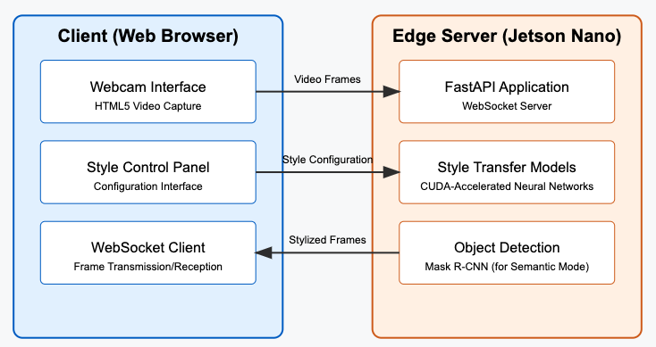

# Fast neural style transfer - focusing on real-time video transfer

A real-time neural style transfer system for videos and images with both complete and semantic stylization capabilities, optimized for edge devices like the NVIDIA Jetson Nano.


## Technical overview
- Our Neural Style Transfer implementation leverages a feed-forward transformer network architecture for efficient real-time video processing. The core system consists of a PyTorch-based transformer network with convolutional, residual, and deconvolutional blocks that apply artistic styles to video frames.
- For complete stylization, frames undergo direct transformation with temporal consistency applied between consecutive frames to prevent flickering artifacts.
- For semantic stylization, we integrate Mask R-CNN object detection to create binary masks enabling different styles for foreground subjects and backgrounds.
- The system includes six pre-trained style models: Vincent van Gogh's "Starry Night" (starry.pth), mosaic pattern (mosaic.pth), Hokusai's "The Great Wave" (wave.pth), anime-inspired "Tokyo Ghoul" (tokyo_ghoul.pth), Francis Picabia's "Udnie" (udnie.pth), and a simplified abstract style (lazy.pth).
- Our client-server architecture uses WebSockets for low-latency communication, with a FastAPI backend processing frames and a browser-based frontend handling capture and display. Extensive performance optimizations, including frame rate control, JPEG compression, targeted resolution, and efficient GPU memory management—enable real-time processing at 40-50 FPS even on resource-constrained edge devices like the Jetson Nano, making computationally intensive neural style transfer practical in bandwidth-limited environments without cloud dependencies.


## Demo for real-time video style transfer running on edge:


## Features

- **Complete Style Transfer**: Apply artistic styles to entire video frames
- **Semantic Style Transfer**: Selectively apply styles to objects or backgrounds
- **Real-time Processing**: Achieves 10-12 FPS on Jetson Nano
- **Web Interface**: Browser-based UI for easy control and visualization
- **Edge Deployment**: Optimized for resource-constrained devices
- **Multiple Style Models**: Six pre-trained style models included

## Architecture

The system uses a client-server architecture with WebSocket communication:

- **Client**: Web browser interface for webcam capture and display
- **Server**: Python FastAPI application for style transfer processing
- **Communication**: Low-latency WebSocket protocol




## Setup and installation
### Prerequisites

- Python 3.8 or higher
- CUDA-capable GPU (recommended) or CPU
- Webcam for real-time processing

### Environment setup

1. Clone the repository:
   ```bash
   git clone https://github.com/yourusername/neural-style-transfer.git
   cd neural-style-transfer

2. Create and activate a virtual environment:
    ```bash
    python -m venv stylizer_env
    source stylizer_env/bin/activate

3. Install dependencies
    ```bash
    pip install -r requirements.txt

### Project structure
    neural-style-transfer/
    │
    ├── app.py                  # FastAPI server for real-time processing
    ├── index.html              # Web client interface
    ├── transformer.py          # Neural network architecture
    ├── utils.py                # Utility functions
    ├── requirements.txt        # Project dependencies
    │
    ├── stylize_static_videos.ipynb    # Notebook for offline video processing
    ├── semantic_stylize_video.ipynb   # Notebook for semantic style transfer
    │
    ├── transforms/             # Pre-trained style models
    │   ├── starry.pth          # Van Gogh's Starry Night style
    │   ├── mosaic.pth          # Mosaic pattern style
    │   ├── wave.pth            # Hokusai's Great Wave style
    │   ├── tokyo_ghoul.pth     # Anime style
    │   ├── udnie.pth           # Francis Picabia's Udnie style
    │   └── lazy.pth            # Abstract style
    │
    ├── videos/                 # Video directories
    │   ├── input/              # Input videos for processing
    │   └── output/             # Stylized output videos
    │
    └── static/                 # Static files for web interface

### Usage: Real-time webcam style transfer
1. Start the server
    ```bash
    python3 app.py
    or
    uvicorn app:app --host 0.0.0.0 --port 8000

2. Open a web browser and navigate to:
    ```bash
    http://localhost:8000
    
3. Use the interface to:
    * Start/stop the webcam
    * Select between complete and semantic stylization modes
    * Choose style models for foreground and background
    * Specify target objects for semantic stylization
    * Toggle color preservation options
